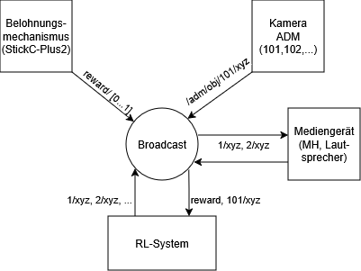

# RL-ADM-OSC System

## Übersicht

Dieses Projekt implementiert ein modulares System zur Entwicklung und Evaluation eines Reinforcement-Learning-Agents zur Steuerung von Mediengeräten über **ADM-OSC**.

Das System besteht aus:
- einer **Gym-basierten RL-Umgebung**
- einer **OSC-Kommunikationsschicht**
- einem **zentralen Broadcast-Hub**
- simulierten Ein- und Ausgabekomponenten (State + Reward)

Ziel ist es, das System lokal zu entwickeln und später direkt auf ein reales Labor-Setup zu übertragen.

---

## Architektur



## Projektstruktur
```mermaid
RL-Framework/
│
├── env/
│ ├── adm_env.py
│ └── state_adapter.py
│
├── osc/
│ ├── osc-hub.py
│ ├── osc_interface.py
│ ├── state_simulator.py
│ └── reward_input.py
│
├── agent/
│ └── train.py
│
├── config.py
└── README.md